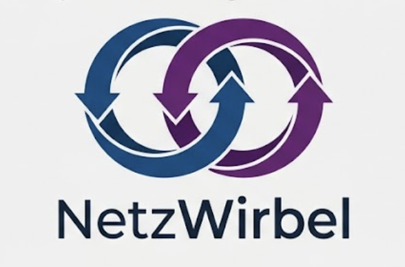

# BanzaiExchange

This example demonstrates a QuickFIX-inspired trading exchange frontend built using NetzWirbel. It connects to the OrderMatchBackend over WebSocket and provides basic order entry and market data display.
